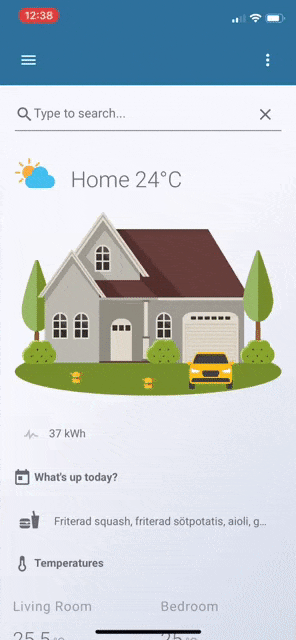

# Search Card

A Lovelace card for Home Assistant that searches Todo list entries and lets you toggle their completed state.



## Features

- 🔍 Quick Todo list entry search within the Home Assistant frontend
- ✅ Option to search ticked (completed) or unticked entries
- 📋 Configurable result limits and placeholder text

## Prerequisites

- Home Assistant
- [card-tools](https://github.com/thomasloven/lovelace-card-tools)

## Installation

### HACS (Recommended)

Search for "Search Card" in HACS and install.

### Manual Install

1. Download `search-card.js`
2. Copy it to `config/www/search-card/` (create directory if needed)
3. Add to your Lovelace resources (example for `ui-lovelace.yaml`):

```yaml
resources:
  - url: /local/search-card/search-card.js?v=0
    type: module
```

## Configuration

### Options

| Name          | Type     | Default             | Description                                  |
| ------------- | -------- | ------------------- | -------------------------------------------- |
| `todo_list`   | string   |                     | The todo list entity id to search (required) |
| `max_results` | integer  | 10                  | Maximum number of search results to display  |
| `search_text` | string   | "Type to search..." | Placeholder text for the search field       |
| `search_ticked` | boolean | true               | When `true` search completed (ticked) items; when `false` search unticked items |

> Note: The card expects a todo integration that exposes a websocket endpoint `todo/item/list` (returns `{ items: [...] }`) and a service `todo.update_item` used to toggle item status.

### Example

```yaml
type: custom:search-card
todo_list: todo.example
max_results: 10
search_text: "Search entries..."
search_ticked: true
```

## Behavior

- Typing in the search field queries the configured todo list and shows matching entries.
- Clicking a result will call the `todo.update_item` service to toggle the entry's status.

## Known issues (and fixes applied)

- The original code used `this.config.search_ticked || true`, which forced the value to `true` even when the user set `false`. This has been fixed so `search_ticked` respects `false` values.
- Results are now sorted by their `summary` before limiting to `max_results` to ensure stable ordering.

## Troubleshooting

If you encounter issues:

1. Clear browser cache
2. Restart Home Assistant
3. Verify `card-tools` is installed
4. Ensure your todo integration provides the expected WS call and service

For bug reports, please open an issue and include your configuration, Home Assistant version, browser, and any error messages.
